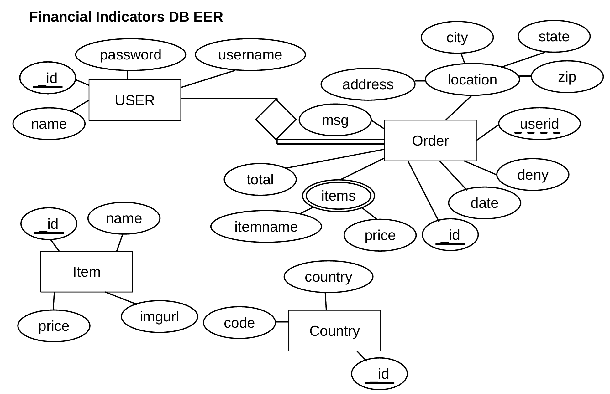

# Visit the Site:

The above image is a YouTube Video. Click the image to view the video.

[VISIT THE SITE](https://webapi-finalproject-react.onrender.com)

[API Repository](https://github.com/supracharger/WebAPI_FinalProject_API)

**PowerPoint Overview:** is located at Overview.pptx

# Description

The site is a toy model that sells financial technical indicators. You can add items to your cart, remove items, and checkout after an address is included.

During checkout it will locate the country in which your IP address is in. Currently, United States and United Kingdom are allowed. If the IP address is not in those two countries it will add a deny flag to the order and display to user. You can add, delete, and modify the countries that are allowed.

# EER Diagram DB

